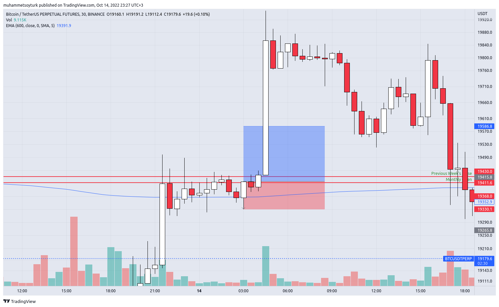
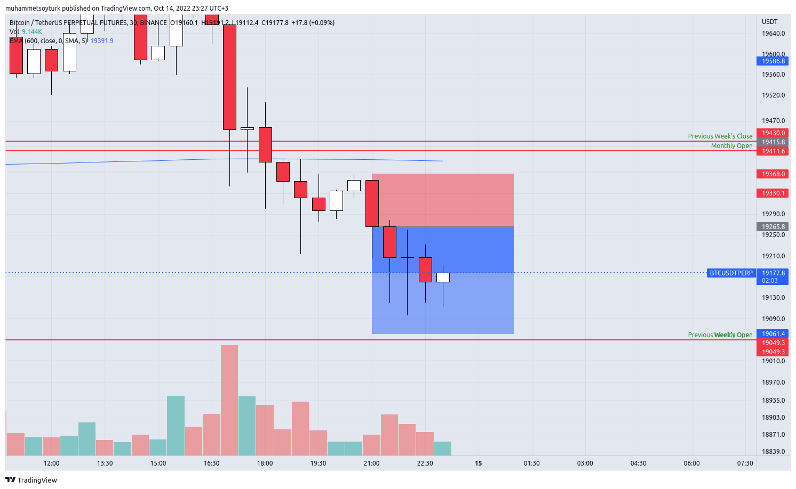
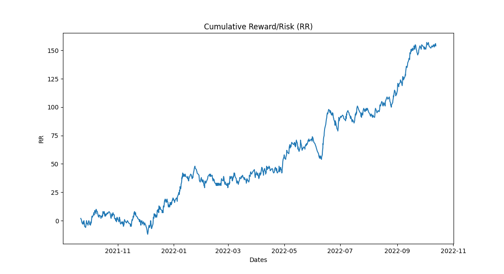

# A trading bot that I've used for a while

This repository contains a trading bot that I used in Binance for a while. It's for educational purposes. Even though, the strategy seems profitable, I don't recommend you to use it. 

## Strategy

### Long Strategy

Requirements:
* Price is above 200 EMA
* Two red candles, followed by an engulfing green candle.
* The price move of engulfing candle is no more than 2 times ATR.

Position info:
* Entry price: Closing of engulfing candle.
* Stop price:  Lowest price of either engulfing or lowest price of the candle before engulfing candle (whichever is lower).
* Take profit price: Entry Price + rr * (Entry Price - Stop Price)

Long example:



### Short Strategy

Requirements:
* Price is below 200 EMA
* Two green candles, followed by an engulfing red candle.
* The price move of engulfing candle is no more than 2 times ATR.

Position info:
* Entry price: Closing of engulfing candle.
* Stop price:  Highest price of either engulfing or highest price of the candle before engulfing candle (whichever is higher).
* Take profit price: Entry Price + rr * (Stop Price - Entry Price)

Short example:



## Backtest Results

TIMEFRAME = 30m
RR = 2
EMA = 200
ATR = 2

You can run the following backtest with: 

```Bash
python main.py --backtest --days-ago 370 --ema-timeperiod 200 --rr 2 --timeframe 30m atr-multiplier 2
```

| Side  | Total R | Win Rate | Num Stops | Num Profits | Num Positions |
| ------------- | ------------- | ------------- | ------------- | ------------- | ------------- | 
| LONG  | 51  | 0.405  | 141  | 96  | 237  |
| SHORT  | 95  | 0.395  | 309  | 202  | 512  |

| Side | Longest Winning Streak | Longest Losing Streak |
| ------------- | ------------- | ------------- |
| LONG |            10          |            8          |
| SHORT |           14          |            17         |



## Install Dependencies

```Bash
pip install -r requirements.txt
```

## Setup your API_KEY and SECRET

Put your API_KEY and SECRET in a new **.env** file.

Example:

```Bash
API_KEY=<YOUR_API_KEY>
SECRET=<YOUR_SECRET>
```

## Deploy

```Bash
crontab -e
*/30  * * * * bash <repo_path>/run.sh >> <repo_path>/log.txt 2>&1
```

<repo_path> is the path where you cloned the repository.